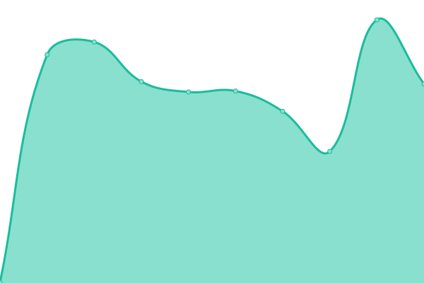

# [📈 Live Status](https://LittleLink-Custom.github.io/uptime): <!--live status--> **🟩 All systems operational**

This repository contains the open-source uptime monitor and status page for [LittleLink Custom](https://littlelink-custom.com), powered by [Upptime](https://github.com/upptime/upptime).

With [Upptime](https://upptime.js.org), you can get your own unlimited and free uptime monitor and status page, powered entirely by a GitHub repository. We use [Issues](https://github.com/LittleLink-Custom/uptime/issues) as incident reports, [Actions](https://github.com/LittleLink-Custom/uptime/actions) as uptime monitors, and [Pages](https://LittleLink-Custom.github.io/uptime) for the status page.

<!--start: status pages-->
<!-- This summary is generated by Upptime (https://github.com/upptime/upptime) -->
<!-- Do not edit this manually, your changes will be overwritten -->
<!-- prettier-ignore -->
| URL | Status | History | Response Time | Uptime |
| --- | ------ | ------- | ------------- | ------ |
|  [Website](https://littlelink-custom.com) | 🟩 Up | [website.yml](https://github.com/LittleLink-Custom/uptime/commits/HEAD/history/website.yml) | 

 881ms
     
 | 

<a href="https://uptime.littlelink-custom.com/history/website">100.00%</a>
    

|  [Demo](https://demo.littlelink-custom.com) | 🟩 Up | [demo.yml](https://github.com/LittleLink-Custom/uptime/commits/HEAD/history/demo.yml) | 

 680ms
     
 | 

<a href="https://uptime.littlelink-custom.com/history/demo">100.00%</a>
    

|  [Our Socials](https://us.littlelink-custom.com) | 🟩 Up | [our-socials.yml](https://github.com/LittleLink-Custom/uptime/commits/HEAD/history/our-socials.yml) | 

 747ms
     
 | 

<a href="https://uptime.littlelink-custom.com/history/our-socials">100.00%</a>
    

|  [LLC Update Server](https://update.littlelink-custom.com) | 🟩 Up | [llc-update-server.yml](https://github.com/LittleLink-Custom/uptime/commits/HEAD/history/llc-update-server.yml) | 

 635ms
     
 | 

<a href="https://uptime.littlelink-custom.com/history/llc-update-server">100.00%</a>
    

|  [LLC Version Server](https://version.littlelink-custom.com) | 🟩 Up | [llc-version-server.yml](https://github.com/LittleLink-Custom/uptime/commits/HEAD/history/llc-version-server.yml) | 

 681ms
     
 | 

<a href="https://uptime.littlelink-custom.com/history/llc-version-server">100.00%</a>
    

|  [LLC Event Server](https://event.littlelink-custom.com) | 🟩 Up | [llc-event-server.yml](https://github.com/LittleLink-Custom/uptime/commits/HEAD/history/llc-event-server.yml) | 

 613ms
     
 | 

<a href="https://uptime.littlelink-custom.com/history/llc-event-server">100.00%</a>
    

|  [LLC Beta Server](https://beta.littlelink-custom.com) | 🟩 Up | [llc-beta-server.yml](https://github.com/LittleLink-Custom/uptime/commits/HEAD/history/llc-beta-server.yml) | 

 595ms
     
 | 

<a href="https://uptime.littlelink-custom.com/history/llc-beta-server">100.00%</a>
    

|  [llc.bio](https://llc.bio) | 🟩 Up | [llc-bio.yml](https://github.com/LittleLink-Custom/uptime/commits/HEAD/history/llc-bio.yml) | 

 785ms
     
 | 

<a href="https://uptime.littlelink-custom.com/history/llc-bio">100.00%</a>
    

|  LLC Test Server | 🟩 Up | [llc-test-server.yml](https://github.com/LittleLink-Custom/uptime/commits/HEAD/history/llc-test-server.yml) | 

 447ms
     
 | 

<a href="https://uptime.littlelink-custom.com/history/llc-test-server">100.00%</a>
    

<!--end: status pages-->

[**Visit our status website →**](https://LittleLink-Custom.github.io/uptime)

## 📄 License

- Powered by: [Upptime](https://github.com/upptime/upptime)
- Code: [MIT](./LICENSE) © [LittleLink Custom](https://littlelink-custom.com)
- Data in the `./history` directory: [Open Database License](https://opendatacommons.org/licenses/odbl/1-0/)
